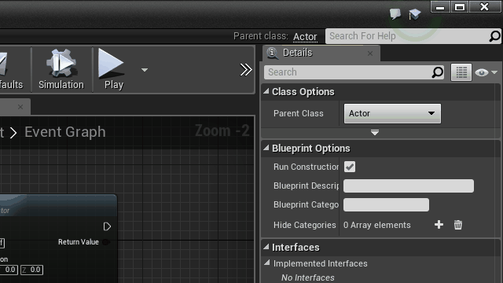

## Software Architecture


Unreal Engine applications are built around the idea of a scene graph, where a **Scene** contains **Actors**, which are composed of **Components**, which are then composed of other complex logic. 

### Threads


### C++ Preprocessing

Unreal allows for users to annotate their C++ to have Properties and Functions be accessible to the editor and thus, blueprint classes that inherit from your C++ code.

#### Properties

```cpp
#pragma once

#include "Runtime/UMG/Public/UMG.h"
#include "GameFramework/Pawn.h"
#include "Probe.generated.h"

UCLASS()
class AProbe : public APawn
{
  GENERATED_BODY()

public:
  AProbe(const FObjectInitializer& ObjectInitializer);

  /** Exposes sphere component to editor */
  UPROPERTY(VisibleAnywhere, BlueprintReadOnly, Category = Collision, meta = (AllowPrivateAccess = "true"))
  class USphereComponent* SphereComponent;

  virtual void BeginPlay() override;

  virtual void Tick( float DeltaSeconds ) override;

};
```

#### Functions

```cpp
#pragma once

#include "Runtime/UMG/Public/Blueprint/UserWidget.h"
#include "ExperimentUserWidget.generated.h"

/**
 * A UMG Widget that fades in/outs
 */
UCLASS()
class UExperimentUserWidget : public UUserWidget
{
  GENERATED_BODY()
  
public: 
  UFUNCTION(BlueprintCallable, Category = Rendering)
  void DrawCurrentTask(FString string);

  virtual bool Initialize() override;

  virtual void NativeTick(const FGeometry& MyGeometry, float InDeltaTime) override;
};
```

You can even convert your Blueprints to C++ code!



### Unreal Modules

Similar to Angular 1.x, Unreal has a built in module system to manage plugins. Even your game is a module that is executed by Unreal (thus the **main** module). Your application would begin by calling a Unreal Macro to create a module that can be loaded by Unreal.

```cpp
//YourGame.h
#include "Engine.h"
//and #include anything else.

//YourGame.cpp
IMPLEMENT_PRIMARY_GAME_MODULE( FDefaultGameModuleImpl, NameOfModule, "Name of Module" );
```

You can create modules for plugins, for games, expansion packs, you name it!

Modules are managed through a C# scripting interface.

```cs
//YourGame.h
#include "Engine.h"
//and #include anything else.

//YourGame.cpp
IMPLEMENT_PRIMARY_GAME_MODULE( FDefaultGameModuleImpl, NameOfModule, "Name of Module" );
//YourGame.Build.cs
using UnrealBuildTool;

public class NameOfModule : ModuleRules
{
    public NameOfModule(TargetInfo Target)
    {
        PublicDependencyModuleNames.AddRange(
        new string[] {
            "Core",
            "CoreUObject",
            "Engine",
            "InputCore"
        });
        //And Any other Plugins

        PrivateDependencyModuleNames.AddRange(
        new string[] {
            "Slate",
            "SlateCore"
        });
    }
}
//YourGame.Target.cs (Is it a Game or in Editor mode?)
using UnrealBuildTool;
using System.Collections.Generic;

public class NameOfModuleTarget : TargetRules
{
    public NameOfModuleTarget(TargetInfo Target)
    {
        Type = TargetType.Game;
    }

    public override void SetupBinaries(
    TargetInfo Target,
    ref List<UEBuildBinaryConfiguration> OutBuildBinaryConfigurations,
    ref List<string> OutExtraModuleNames
    )
    {
        OutExtraModuleNames.AddRange( new string[] { "Name of Module" } );
    }
}
```

## Renderer

### RHI

Rendering is done by queuing up command buffers, basically functions that are executed by the render thread that perform graphic logic. Every single Unreal engine draw call boils down to enquing rendering tasks to Unreal's render scheduler:

```cpp
ENQUEUE_UNIQUE_RENDER_COMMAND(...);
```

### Slate UI System

#### Draw Event Order


Unreal performs a lot of batched draw calls in the UI for efficiency. 


*Right Click Menus* and *Tooltips* are actually just render targets that are placed on top of the main window, rather than their own unique windows.

### Core Render Pipeline

Unreal Engine 4's rendering pipeline is pretty complex, so let's break it down into steps:

```bash
├─ 🚩 Frame 1 
│   ├─ ⚪ InitViews               # Initialize/Update data structures
│   ├─ ⏰ TemporalSamplingSetup   # Temporal Anti-alias calculations
│   ├─ 🔲 BasePass(es)            # Albedo, Normal, Roughness/Metallic, Depth
│   ├─ 🌓 ShadowDepths            # Shadow Maps
│   ├─ 💨 MotionBlurVelocities    # Motion blur calculations
│   ├─ 💡 Lights                  # Direct/Indirect Lighting
│   ├─ 🔎 ScreenSpaceReflections  # Reflections
│   ├─ 🌎 Atmosphere              # Atmospheric scattering
│   ├─ 📹 PostProcessing          # Temporal Anti-Aliasing, Motion Blur, Bloom, etc.
│   └─ 🎦 SlateUI(s)              # Unreal UIs
└─ 🚩 Frame 2...
```


There's a lot more to it than just those things, but the key to it all is the **Base Pass** step (pictured above) where your materials get rendered, and the **Post-Processing** step where your scene goes through color toning and cool effects like motion blur. 

## Inputs

As as smart level of indirection, Unreal has a built in Input mapping system where instead of keys, you can describe actions and map keys to those actions, just in case the player wants to remap users ( or needs to in the case of him/her having a disability).

```cpp
void AProbe::SetupPlayerInputComponent(class UInputComponent* InputComponent)
{
  Super::SetupPlayerInputComponent(InputComponent);

  // Unreal maintains a dictionary of "Keys" or "Axes"
  // You can bind callback functions or read from these values
  // After they're bound to your class.

  InputComponent->BindAxis("LookRoll");
  InputComponent->BindAxis("LookRight");
  InputComponent->BindAxis("LookDown");

  InputComponent->BindAxis("MoveFoward");
  InputComponent->BindAxis("MoveRight");
  InputComponent->BindAxis("MoveUp");

  InputComponent->BindAxis("Zoom");
}
```